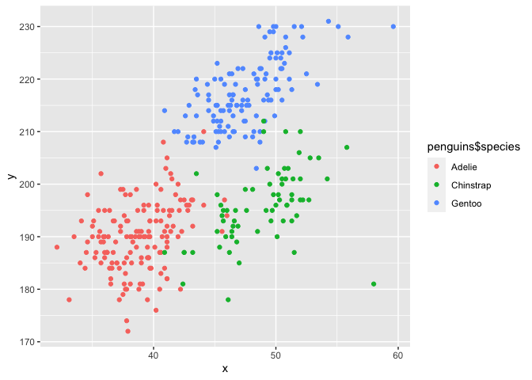

p8105_hw1_st3431
================
Supraja Teki
2022-09-21

``` r
library(tidyverse)
```

    ## ── Attaching packages ─────────────────────────────────────── tidyverse 1.3.2 ──
    ## ✔ ggplot2 3.3.6      ✔ purrr   0.3.4 
    ## ✔ tibble  3.1.8      ✔ dplyr   1.0.10
    ## ✔ tidyr   1.2.0      ✔ stringr 1.4.1 
    ## ✔ readr   2.1.2      ✔ forcats 0.5.2 
    ## ── Conflicts ────────────────────────────────────────── tidyverse_conflicts() ──
    ## ✖ dplyr::filter() masks stats::filter()
    ## ✖ dplyr::lag()    masks stats::lag()

## Problem 1

``` r
data("penguins", package = "palmerpenguins")

summary(penguins)
```

    ##       species          island    bill_length_mm  bill_depth_mm  
    ##  Adelie   :152   Biscoe   :168   Min.   :32.10   Min.   :13.10  
    ##  Chinstrap: 68   Dream    :124   1st Qu.:39.23   1st Qu.:15.60  
    ##  Gentoo   :124   Torgersen: 52   Median :44.45   Median :17.30  
    ##                                  Mean   :43.92   Mean   :17.15  
    ##                                  3rd Qu.:48.50   3rd Qu.:18.70  
    ##                                  Max.   :59.60   Max.   :21.50  
    ##                                  NA's   :2       NA's   :2      
    ##  flipper_length_mm  body_mass_g       sex           year     
    ##  Min.   :172.0     Min.   :2700   female:165   Min.   :2007  
    ##  1st Qu.:190.0     1st Qu.:3550   male  :168   1st Qu.:2007  
    ##  Median :197.0     Median :4050   NA's  : 11   Median :2008  
    ##  Mean   :200.9     Mean   :4202                Mean   :2008  
    ##  3rd Qu.:213.0     3rd Qu.:4750                3rd Qu.:2009  
    ##  Max.   :231.0     Max.   :6300                Max.   :2009  
    ##  NA's   :2         NA's   :2

``` r
  summary(penguins$flipper_length_mm)
```

    ##    Min. 1st Qu.  Median    Mean 3rd Qu.    Max.    NA's 
    ##   172.0   190.0   197.0   200.9   213.0   231.0       2

``` r
  summary(penguins$species)
```

    ##    Adelie Chinstrap    Gentoo 
    ##       152        68       124

``` r
nrow(penguins)
```

    ## [1] 344

``` r
ncol(penguins)
```

    ## [1] 8

``` r
mean(penguins$flipper_length_mm, na.rm=T)
```

    ## [1] 200.9152

``` r
plot_df=
  tibble(
    x=penguins$bill_length_mm,
    y=penguins$flipper_length_mm
  )
  
ggplot(plot_df, aes(color=penguins$species, x = x, y = y)) + geom_point()
```

    ## Warning: Removed 2 rows containing missing values (geom_point).

<!-- -->

## Problem 2

``` r
hw_df=tibble(random_sample=rnorm(10), 
  vec_logic=random_sample>0, 
  vec_character=c("a","b","c","d","e","f","g","h","i","j"), 
  vec_factor=factor(c("low", "medium", "high", "low","medium","high", "low","medium","high","low")) )

#means of variable within the df
  mean(hw_df$vec_logic)
```

    ## [1] 0.4

``` r
  mean(hw_df$vec_character)
```

    ## Warning in mean.default(hw_df$vec_character): argument is not numeric or
    ## logical: returning NA

    ## [1] NA

``` r
  mean(hw_df$vec_factor)
```

    ## Warning in mean.default(hw_df$vec_factor): argument is not numeric or logical:
    ## returning NA

    ## [1] NA

``` r
  mean(hw_df$random_sample)
```

    ## [1] 0.03032799

``` r
as.numeric(hw_df$vec_logic)
as.numeric(hw_df$vec_character)
as.numeric(hw_df$vec_factor)
```
